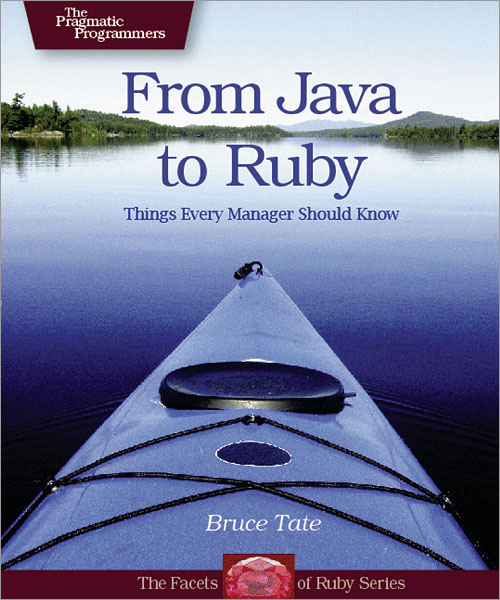
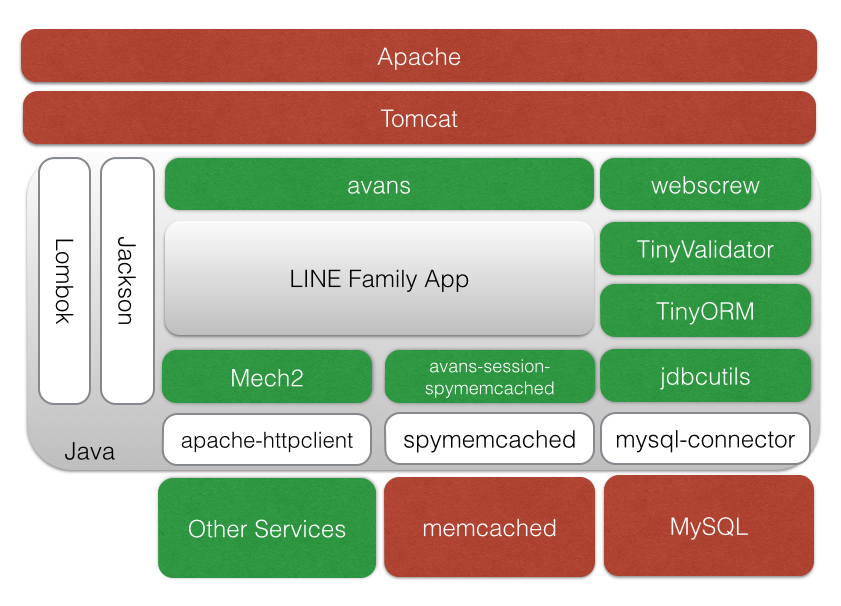

!SLIDE 
# Why and How of Java8  at LINE Fukuoka
[@youhei](https://twitter.com/youhei)

Today's hashtag: \#LINE_DM

!SLIDE commandline incremental

# 自己紹介

    $ whoami
    新田 洋平
    2014年9月入社
    LINE ファミリーアプリサーバーサイド開発担当
    ちょっと前は Python や AWS と戯れてました
    twitter: @youhei
    他もだいたい youhei

!SLIDE

# 今日これから話すこと
* LINE Fukuoka の現状
* なぜ Java を使うようになったか
* なぜ Java8 を選んだのか
* どうやって Java8 で開発しているか
* 実際使ってきてどうだったか

!SLIDE

# LINE Fukuoka の現状

!SLIDE bullets incremental

## 福岡で作ってる LINE Family Apps

* LINE 占い
* LINE MALL
* LINE Creaters Market

!SLIDE 
# サーバサイドは全部 Perl
LINE Family App は Perl が主力です

!SLIDE bullets incremental
# 2014/9 入社間も無い頃
* 「Java でやるプロジェクトがあるので、
* youhei さんやってみます？」

!SLIDE
# Java？

!SLIDE
# Perl じゃないの？

!SLIDE
# ということで

!SLIDE
# 六年ぶりに Java はじめました

!SLIDE
# そもそもなぜ Java なのか
Why we use Java?

!SLIDE
# まずは社内の状況確認

!SLIDE incremental
# 確認結果
* 弊社 GitHub:enterprise で人気最上位の言語は Java
* Spring を使った Java のプロジェクト多数
* LINE バックエンドでも[大活躍](http://developers.linecorp.com/blog/ja/?p=3392)
* Sonatype Nexus でライブラリを管理
* Jenkins もガンガン使ってる

!SLIDE
# めっちゃ Java 使ってた

!SLIDE
# 知らなかっただけで めっちゃ Java の会社でした

!SLIDE
# じゃあなぜ Java 8 なのか
Why we choose Java 8?

!SLIDE incremental
# プロジェクトアサイン当初
* つくるもの: JSON-RPC Server
* ライブラリの選択は自由
* 運用上の制約さえ守れば良く
* しがらみも少ない
* 「よし、」

!SLIDE
# 「できる限り新しいものを使おう」

!SLIDE
# なぜ新しいもの？

!SLIDE center

!SLIDE bullets incremental
# 2006 年頃の  Java から LL への流れ
* 「Java だとさくさく作れないから LL へ」
* 元の木阿弥にならないために
* 「さくさく作れる Java」でないといけない
* 「重厚長大」は NG

!SLIDE bullets incremental
# 社内をみると
* Java 8 で先行している Project があった
* 「[Java で 1 から 10 まで書いた話](http://www.slideshare.net/tokuhirom/java110sanitized)」参照
* Perl をずっと書いてきた人にも馴染みやすい Java

!SLIDE
# これはすごい

!SLIDE
# 乗るしかない このビッグウェーブに

!SLIDE
# その結果、

!SLIDE
# 現在の構成は こうなりました

!SLIDE incremental small
## 使っているモジュール
* avans - Tiny thin web application framework for Java 8
* webscrew - Web application toolkit for Java servlet
* tinyorm - O/R mapper for Java 8
* tinyvalidator - Tiny validation framework
* mech2 - HTTP client
* jackson - Json parsing and generation
* lombok - Reduce boilerplate code
* 緑字は社内に Author がいる OSS, 黒字はそうでない OSS

!SLIDE
# 構成図

!SLIDE center

!SLIDE
# この構成で

!SLIDE
# どうやって Java8 で開発しているか
How we use Java8?

!SLIDE bullets incremental
## よく使う Java 8 の新機能

1. Optional
1. lambda
1. default method
1. Stream API

!SLIDE
## よく使う Java 8 の新機能

1. **Optional**
1. lambda
1. default method
1. Stream API

!SLIDE
# Optional
値が含まれている場合も 
含まれていない場合もあるコンテナ・オブジェクト

!SLIDE
# コンテナ・オブジェクト
配列, List, Map などのデータ構造の総称

!SLIDE
# ランタイムに null 参照をさけるためのコンテナが

!SLIDE
# Optional

!SLIDE small

# Optional の基本
「値がないかも」を明示して NullPointerException をさける 
チェック漏れはコンパイラがチェックする

    @@@ Java
    // 値がないと nobody
    // Optional<String> maybeName
    String name = maybeName.orElse("nobody");
    // 値があると someMethod(d) を処理
    // Optional<T> data
    data.ifPresent(d -> someMethod(d));

!SLIDE
# Real World Example
avans, tinyorm のコード例

!SLIDE small
# avans で Query Parameter が任意かどうかを明示する
利点はコード上に仕様が明記される、デフォルト値の考慮漏れもなくなる、の二点。

    @@@ Java
    @GET("/api/items")
    public WebResponse list(@Param("page") OptionalInt page) {
        int pageNumber = page.orElse(1); // デフォルト値は 1

!SLIDE small
# tinyorm で単一行の削除
SELECT FOR UPDATE した結果がある場合のみ DELETE を発行

    @@@ Java
    TinyORM db = TinyORM(connection);
    db.single(ItemRow.class)
        .where("id=?", id)
        .forUpdate()
        .execute()  // Optional<ItemRow> を返す
        .ifPresent(row -> row.delete());
        // ItemRow がある場合だけ DELETE!

!SLIDE incremental
# Optional まとめ
* 安全なコードが書けるようになる
* コードのドキュメント性があがる
* Web層、DB層の API が対応しているとより強力

!SLIDE
## よく使う Java 8 の新機能

1. Optional
1. **lambda**
1. default method
1. Stream API

!SLIDE
# ラムダ式は一種の糖衣構文

!SLIDE
# 匿名クラスのインスタンス生成の コードを置き換えられるイメージ

!SLIDE small incremental
# ただ匿名クラスのインスタンス生成の 糖衣構文ではない。

* ラムダ式は匿名クラスとは異なるバイトコードを吐く
* invokedynamic で実行時にラムダオブジェクトを生成する処理に置き換わる
* 匿名クラスファイル(Foo$1.class)を作らずに済むし、インスタンス生成のコストも下がる

!SLIDE

# ラムダ式の基本

!SLIDE small

# ラムダ式の基本(Java 7 以前)
匿名クラスで関数を渡していた冗長な時代

辞書順にソートするコード。

    @@@ Java
    // Java 7 以前の文法に沿った表現
    Collections.sort(lists, new Comparator<String>() {
        public int compare(final String o1, String o2) {
            return o1.compareTo(o2);
        }
    });

!SLIDE small
# ラムダ式の基本(Java 8 ラムダ式)
同じコードをラムダ式で書く。多くの要素を省略できる。

    @@@ Java
    // 省略なし
    Collections.sort(lists, (final String o1, final String o2) -> {
            return o1.compareTo(o2);
        });

    // 処理が1行だとコードブロックの波括弧と return は省略可
    Collections.sort(lists,
        (final String o1, final String o2) -> o1.compareTo(o2));

    // 型推論で引数の型宣言を省略可。final の明示はできなくなる。
    // (引数が一個の場合、引数の括弧も省略可)
    Collections.sort(lists, (o1, o2) -> o1.compareTo(o2));

    // メソッド参照
    Collections.sort(lists, String::compareTo);

!SLIDE small incremental
# 実質的final
* 匿名クラスではエンクロージングクラス(匿名クラスを宣言しているクラス)の変数が final でない場合はアクセスすることは言語仕様上できなかった。
* ラムダ式とこの仕様は相性が良くない。そこで、
* ラムダ式でエンクロージングクラスの変数を利用した場合はその変数を「実質的 final」と定義した。その変数は final が付いているものとしてみなされる。
* 変数に再代入してしまうと実質的 final ではなくなるのでラムダ式で使おうとするとコンパイルエラーになる。

!SLIDE small
# 実質的final(コード例)
familyName に値を代入するとコンパイルエラー。知らないと大変ハマる。

ラムダ式内での値の変更もコンパイルエラー。

    @@@ Java
    String familyName = "Isono"; // 実質的 final
    family.forEach(
        firstName -> {
            System.out.println(
                String.format("%s %s", firstName, familyName)
        });
    // familyName = "Fuguta"; このコメントを外すとコンパイルエラー

!SLIDE small
# 以上がラムダ式の言語仕様
ちょっと覚えることが多い

!SLIDE
# Real World Example
avans, tinyorm のコード例

!SLIDE smaller

# avans で CSV を返す
HttpServletResponse に依存した処理をラムダ式内で扱う。

CallbackResponse のラムダ式は csv() 内ではなく avans に処理を返してから遅延実行される。

    @@@ Java
    @GET("/csv")
    public WebResponse csv() {
        return new CallbackResponse(resp -> {
            resp.setContentType("text/csv; charset=UTF-8");
            resp.setHeader("Content-Disposition",
                "attachment;filename=my-file-name.csv");

            CSVFormat format = CSVFormat.EXCEL;
            try (Writer writer = resp.getWriter();
                 CSVPrinter csvPrinter = new CSVPrinter(writer, format)) {
                    csvPrinter.printRecord(
                        Arrays.asList("こんにちは", "世界"));
            }
        });
    }

!SLIDE small

# tinyorm で 複雑なクエリをマッピングする
GROUP BY したり JOIN する複雑なクエリは SQL を直接書くポリシー。

ResultSet をラムダ式内で扱う。

    @@@ Java
    db.executeQuery(
        "SELECT count(*) as cnt FROM item GROUP BY group_id",
        rs -> {
            List<Long> result = new ArrayList<>();
            while (rs.next()) {
                result.add(rs.getLong("cnt"));
            }
            return result;
        });

!SLIDE incremental
# lambda まとめ
* 特殊な処理をシンプルに局所化できる (関心の分離)
* リソース解放を意識しないコードを強制できる
* Web層、DB層のライブラリが対応してるとより強力

!SLIDE
## よく使う Java 8 の新機能

1. Optional
1. lambda
1. **default method**
1. Stream API

!SLIDE small

# default method の基本
interface に default 実装を定義できるようになった。

さらっと扱われがちだけどとても大きな変更点。

    @@@ Java
    interface Person {
        String getFirstName;
        String getFamilyName;
        default String getFullName() {
            return String.format("%s %s",
                getFirstName(), getFamilyName());
        }
    }

!SLIDE small

# interface static method
static method も定義できるようになった。

Collections, Paths のようなユーティリティメソッドを集めたコンパニオンクラスを 定義する理由は「これまでの慣習を尊重する」以外になくなった。 

Collection, Path に static method を定義可能になったため。

    @@@ Java
    interface Person {
        static Person of() {
            return new DefaultPerson("Foo", "Bar");
        }
    }

!SLIDE
# Real World Example
avans のコード例

!SLIDE smaller

# avans plugin を実装する
avans の plugin は Controller への Mix-in となっている。default method で実装する。

interface は状態を持てないのでその部分を PluginStash として avans が提供している。

    @@@ Java
    // avans plugin
    public interface SessionMixin extends Controller {
        static final String STASH_KEY = "session";

        public default WebSessionManager getSession() {
            final Object session = 
                this.computePluginStashValueIfAbsent(
                    this.getClass(),
                    STASH_KEY, () -> {
                        return this.buildSessionManager();
                    });
            return (WebSessionManager) session;
        }
        // 以下、省略

    // Controller
    public class FooController implements SessionMixin {

!SLIDE incremental
# default method まとめ
* interface に実装を持てることで継承で実装を追加できる
* 必ずしも「継承よりコンポジション」ではなくなった
* Mix-in は Annotation と並んでフレームワークが拡張性を提供する優れた手段

!SLIDE
## よく使う Java 8 の新機能

1. Optional
1. lambda
1. default method
1. **Stream API**

!SLIDE
# Stream API とは

!SLIDE
# Collection を宣言的に操作できる API

!SLIDE bullets incremental
* ここまで出てきた
* Optional
* lambda
* default method
* を駆使している

!SLIDE

!SLIDE smaller
# Stream API の基本 - 従来の命令型スタイル

価格が20ドルより大きい場合は10%引きして値引きした商品の金額合計を計算

    @@@ Java
    public static void main(final String... args) {
        int[] prices = {10, 20, 30, 40};
        int totalOfDiscountedPrices = 0;

        for(int price : prices) {
            if (price > 20) {
                totalOfDiscountedPrices =
                    totalOfDiscountedPrices + (int) (price * 0.9);
            }
        }
        System.out.println("Total of discounted prices: " + totalOfDiscountedPrices);
    }

!SLIDE smaller
# Stream API の基本 - 関数型スタイル

同様の計算を関数型スタイルにする

    @@@ Java
    public static void main(final String... args) {
        int[] prices = {10, 20, 30, 40};
        int totalOfDiscountedPrices =
            Arrays.stream(prices) // IntStream に変換
                .filter(price -> price > 20) // 20 を超えるものを抜き出す
                .map(price -> (int) (price * 0.9)) // 0.9 掛けした値に変換
                .sum(); // 合計する

        System.out.println("Total of discounted prices: " + totalOfDiscountedPrices);
    }

!SLIDE
# 一時的な値が不要で再代入がない

!SLIDE
# 宣言的で間違いも起こりにくい

!SLIDE
# ただ、必ずしも短く書けるわけでもない

!SLIDE
## Stream API のインパクトは意外と小さい
## Stream を API で受け渡すことは少ない
## メソッド内の処理がシンプルになるのみ

!SLIDE small
# Stream API と拡張 for 文の関係
* Stream API の出現で「forEach を使えば for 文不要」という話題もあるが lambda の中でチェック例外を扱うよりは、拡張 for 文にしてチェック例外はフレームワークに任せた方が可読性が高いこともある
* Web アプリはチェック例外も Internal Server Error で処理しておしまい、というケースが多いので、現在は Stream API 一辺倒にはならずに拡張 for 文も使ってる

!SLIDE incremental
# Stream API まとめ
* 型安全にある程度すっきり書ける(LL よりは冗長だけど)
* 宣言的に書けるのでバグを埋め込みにくい
* とはいえ拡張 for 文も使ってる

!SLIDE
# 以上が Java 8 の新機能を使ってみての所感

!SLIDE
# ただ、

!SLIDE
# もっとシンプルさが欲しい

!SLIDE
# そこで

!SLIDE
# 
http://projectlombok.org

!SLIDE small
# with lombok

    @@@ Java
    import lombok.NonNull;

    public class NonNullExample extends Something {
        private String name;

        public NonNullExample(@NonNull Person person) {
            super("Hello");
            this.name = person.getName();
        }
    }

!SLIDE small
# Vanilla Java

    @@@ Java
    import lombok.NonNull;

    public class NonNullExample extends Something {
        private String name;

        public NonNullExample(@NonNull Person person) {
            super("Hello");
            if (person == null) {
                throw new NullPointerException("person");
            }
            this.name = person.getName();
        }
    }

!SLIDE
# アノテーションで
# 退屈なコードを減らす

!SLIDE
# そもそもなぜ こんなことが可能か

!SLIDE
# lombok の仕組み

!SLIDE
# 通常のコンパイルの流れ
javac や Eclipse Compiler for Java がソースコードを解釈して抽象構文木を生成し、バイトコードにコンパイルする

1. ソースコード(.java)
1. 抽象構文木
1. バイトコード(.class)

!SLIDE
# lombok の仕組み
コンパイル時に AnnotationProcessor を利用して取得した抽象構文木を変換している。internal な API を呼んでいるとか。

1. ソースコード(.java)
1. **抽象構文木** ← ココを横取りして書き換え
1. バイトコード(.class)

!SLIDE
# この仕組みは何が嬉しいか?

!SLIDE
# ソースコード生成と違って
# 取り扱いがラク

!SLIDE
# 良くも悪くも
# 痕跡が残らない

!SLIDE
# バイトコード変換と違って
# 実行時に魔法はない

!SLIDE
# よく使う Annotation
1. @Data
1. @Value
1. @SneakyThrows

!SLIDE small
# @Data
JavaBeans の getter/setter, toString, hashCode, equals を生成する。

Jackson で受け渡しする JSON オブジェクトなどに多用してる

    @@@ Java
    @Data
    public class ContactForm {
        @Email // tinyvalidator
        private String email;
        @NotNull // tinyvalidator
        private String body;
    }

!SLIDE small
# @Value
@Data の不変オブジェクト版(setter が生成されない)。

java.beans.ConstructorProperties でアノテーションされたコンストラクタを生成する。

TinyORM は ConstructorProperties を解釈するため、Row を不変オブジェクトにできる。

    @@@ Java
    @Value
    @Table("contact") // tinyorm
    @EqualsAndHashCode(callSuper = false) // 継承先を考慮しない
    public class ContactRow extends Row<ContactRow> {
        @Column // tinyorm
        private String email;
        @Column
        private String body;
    }

!SLIDE small
# @SneakyThrows
チェック例外を非チェック例外にして投げる。

Internal Server Error を返すしかないような例外はチェックせず SneakyThrows を使う。

ただ最近は SneakyThrows を使わず throws 節を宣言するのがトレンドになってきた。

    @@@ Java
    @POST("/upload")
    @SneakyThrows
    public WebResponse upload(@UploadFile("file") Part file) {
        String body = IOUtils.toString(
            file.getInputStream(), "UTF-8");
        return this.renderText(body);
    }

!SLIDE small
# lombok.val
final なローカル変数を短く宣言できる。使おうかと思ったが、IntelliJ IDEA が未対応なので断念。

Eclipse でもエラーになるという噂がちらほら。

ただ、今となってはダイヤモンド演算子で十分とも思う。

    @@@ Java
    import lombok.val;

    public class Main {
        public void main(String... args) {
            // lombok.val
            val example = new ArrayList<String>();
            // diamond operator
            final ArrayList<String> example2 = new ArrayList<>();

!SLIDE
# F.A.Q.

!SLIDE small bullets incremental
# Q. テストは?

* Model のテストと Controller のテストをしてる。
* Model のテストは MySQL をそのまま使う。
* Controller は tomcat-embed を起動して HTTP Client を使う。
* いわゆる end-to-end なテスト。
* 別サービスへのアクセスは tomcat-embed と avans で Mock を書く。

!SLIDE small bullets incremental
# Q. 静的解析とかしてる?

* checkstyle, findbugs を使ってる。
* jenkins で動かしてる。
* Checkstyle は Java8 対応版を社内ビルドして使ってる。
* lombok.GetterLazy が FindBugs で怒られる...

!SLIDE
# Q. 社内に Author がいる Web Framework の利点とは?

!SLIDE
# 現場のニーズに完璧にフィットする
必要にかられて作られている。

最低限の必要な機能を提供している。

足りない機能は Mix-in, 独自 Annotation で自分たちで拡張できる。

!SLIDE
# 余分なコードがほぼゼロで見通しが良い
Spring Boot や Dropwizard より軽量

また、どんな汎用 micro framework にも使わない機能のためのコード、使わないミドルウェアのためのコードは必ずあるもの。

!SLIDE
# 実装の意図が把握しやすい
直接聞けることは良いことだ。

非互換の変更が入るとすぐアナウンスをもらえる。

!SLIDE
# Q. avans, tinyorm 自体の良さとは?

!SLIDE
# Java 8 を前提としている
サービスのコードが自然と Java 8 らしいコードに矯正される。

!SLIDE
# 依存がヒッジョーに少ない

!SLIDE
# よって外部要因に左右されにくい
最悪自分たちでなんとかできる、というビジネス面でのメリット。

再び歩み始めた Java の継続的進化に追随しやすい、という技術面でのメリット。

!SLIDE
# 覚えることが少ない
別のことに時間を使える

Java SE 8 の言語仕様を知ったり、Servlet 3.x API を把握したり。

良いコードの書き方を知ることに時間を割こう。

!SLIDE
# 最後に

!SLIDE bullets incremental
# これは現時点でのスナップショット
* 弊社で Java 8 の本格利用は始まったばかり
* 現在もより良い構成をブラッシュアップしてる最中
* 紆余曲折を現場で体験出来ているのはエンジニアとしてとても幸せ

!SLIDE
# LINE Family App の Java は始まったばかり
やらなきゃいけないことも、やりたいこともまだまだたくさん

だからこそ楽しい

!SLIDE
# ご清聴ありがとうございました

!SLIDE smaller 
# 参考資料
* [LL から Java に移行した人がはまりがちなこと](http://blog.64p.org/entry/2014/10/01/081703)
* [Java で 1 から 10 まで書いた話](http://www.slideshare.net/tokuhirom/java110sanitized)
* [Java SE 8 実践プログラミング](http://book.impress.co.jp/books/1114101010)
* [Java による関数型プログラミング](http://www.oreilly.co.jp/books/9784873117041/)
* [Java の lambda の裏事情](http://www.slideshare.net/nowokay/java-28986016)
* [ProjectLambda・２部(ラムダ式(実質的にfinal・スコープ)～メソッド・コンストラクタ参照)](http://d.hatena.ne.jp/bitter_fox/20120218/1329585343)
* [Lombokのチュートリアル記事Reducing Boilerplate Code with Project Lombokをテキトーに訳した](http://kagamihoge.hatenablog.com/entry/2014/02/07/204236)
* [avans](https://github.com/tokuhirom/avans), [webscrew](https://github.com/tokuhirom/webscrew), [tinyorm](https://github.com/tokuhirom/tinyorm), [tinyvalidator](https://github.com/tokuhirom/tinyvalidator), [mech2](https://github.com/tokuhirom/mech2)

!SLIDE
# 質疑応答
